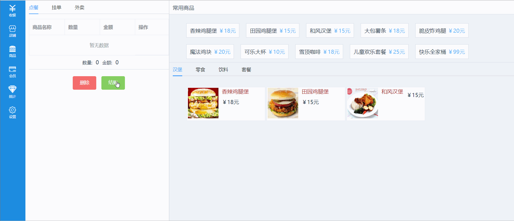

# Vue awesomePos

> Vue awesomePos Demo 收银系统


## Build Setup

``` bash
# install dependencies
npm install

# serve with hot reload at localhost:8080
npm run dev

# build for production with minification
npm run build

```

## 技术栈

- vue2：基础框架
- vue-router2：路由跳转
- es6：采用部分es6特性，大大简化了写法
- webpack：vue-cli基于webpack，修改了部分配置
- axios：基于Promise的http库，用来请求数据

## 实现功能

- [x] 首页列表数据
- [x] 首页单个删除
- [x] 首页多个删除
- [x] 首页结账功能

## 项目结构

```bash

├── build                    // 构建服务和webpack配置
├── config            		 // 项目不同环境的配置
├── dist               		 // 项目build目录
├── index.html          	 // 项目入口文件
├── package.json      		 // 项目配置文件
├── static       			 // 放置静态资源
├── src                		 // 生产目录
│   ├── common          	 // 公共的js,fonts资源,以及可以复用的公共组件，如Loading等
│   ├── components     		 // 各业务组件
│   ├── App.vue         	 // 主页面
│   ├── router    		     // 路由配置
│   └── main.js       	     // Webpack 预编译入口

```

## 部分截图




